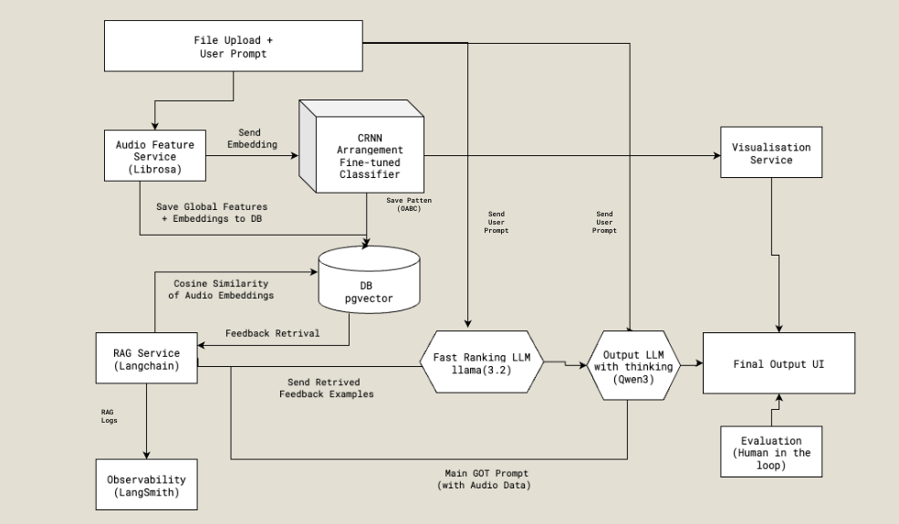
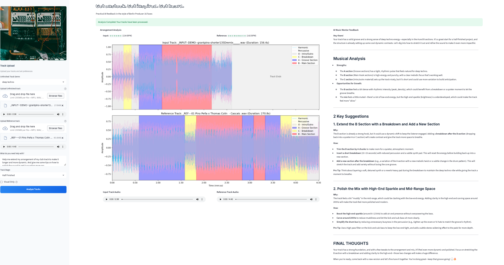
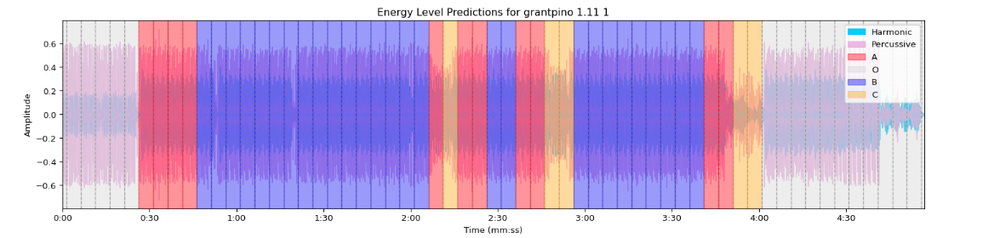
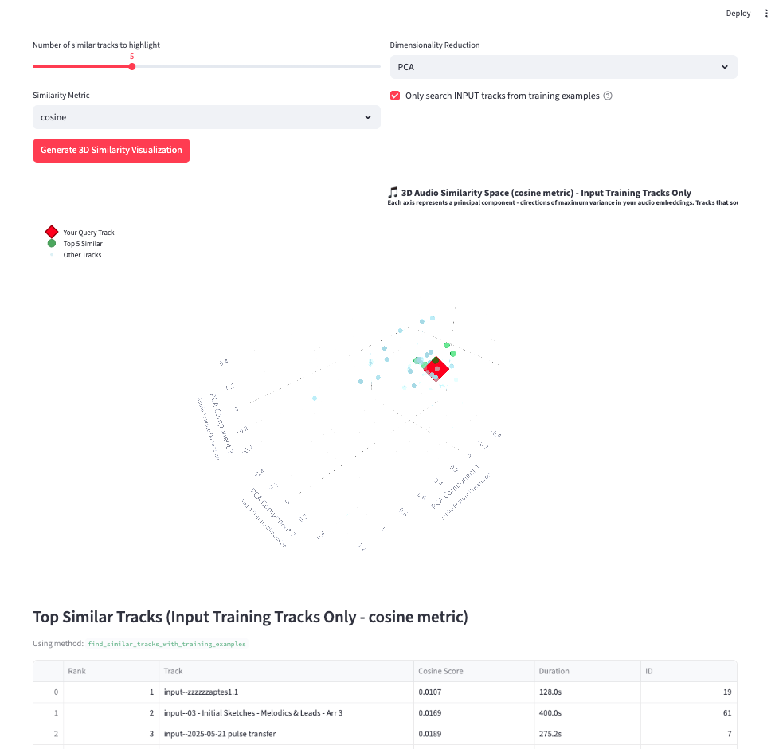
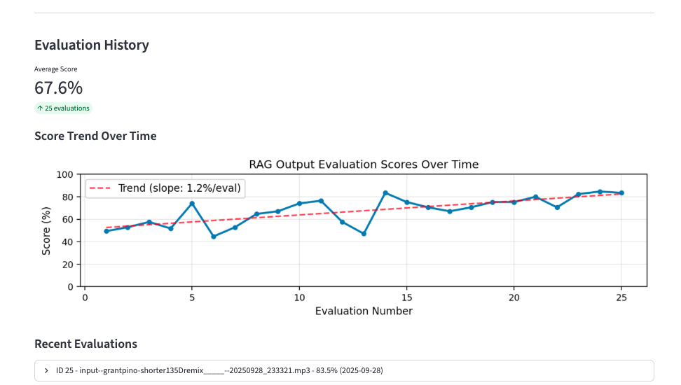

# AI Music Mentor - Intelligent Music Production Feedback Tool

An advanced AI-powered music production assistant that analyzes your unfinished electronic music tracks and provides personalized arrangement advice using state-of-the-art RAG (Retrieval-Augmented Generation) technology, deep learning arrangement classification, and audio feature analysis.

## 📖 Development Deep Dive

**[→ Read LEARNINGS.md](LEARNINGS.md)** - An in-depth technical analysis of my complete approach, covering every aspect of the system architecture, AI model design, RAG implementation, and key learnings from this intensive 1-month development sprint. Essential reading for recruiters and CTOs interested in my technical decision-making process.

**[→ Demo Day Presentation](references/)** - Reference slides from the final demo presentation, providing a high-level overview of the project objectives, technical approach, and key results. Useful for understanding the project context and presentation format.

## ⚠️ Repository Notice

**This repository has core components excluded and is not meant to be run from scratch.** It requires proprietary CRNN models and producer feedback data to operate fully.

**However, you can set up and run `app.py` and `admin.py` to explore the UI and codebase structure** - you just won't be able to generate predictions or feedback without the missing CRNN models and populated database with audio examples and producer feedback. The installation instructions below are useful for testing the repo architecture and understanding the implementation for learning purposes.

**Please contact me privately via [LinkedIn](www.linkedin.com/in/grantwilliamthomas/) if you would like to know more about the complete implementation.**

This repo serves as a **learning resource and portfolio piece** showcasing my final Data Science Retreat project from 2025.

[](https://www.python.org/downloads/)
[](LICENSE)
[](https://streamlit.io/)

## What It Does

Upload your work-in-progress electronic music track alongside a reference track, and get intelligent, actionable feedback on:

- **Arrangement Structure**: AI identifies and analyzes your track's sections (intro/outro, grooves, drops, breakdowns)
- **Musical Development**: Concrete suggestions for extending, adding, or modifying sections
- **Feature Comparison**: Technical analysis comparing your track to the reference (tempo, energy, frequency distribution)
- **Producer-Style Feedback**: Natural language advice in the style of experienced electronic music producers

## Technical Architecture


_Complete system architecture showing audio processing pipeline, RAG system, and feedback generation_

This system combines multiple AI technologies:

- **Custom CRNN Model**: Deep learning classifier for automatic arrangement section detection
- **RAG Pipeline**: Vector similarity search through a database of expert-labeled training examples
- **Audio Feature Extraction**: Musical features using Librosa (spectral, rhythmic, tonal analysis)
- **LLM Integration**: Local inference using Ollama with LangChain for contextual feedback generation
- **Vector Database**: PostgreSQL with embedding similarity search for track matching

## Setup

### Prerequisites

- Python 3.13+
- [uv](https://docs.astral.sh/uv/) package manager
- PostgreSQL database
- [Ollama](https://ollama.ai/) with qwen3:8b and llama3.2 models

### Installation

1. Clone the repository:

```bash
git clone https://github.com/granttnarg/AI-Music-Mentor.git
cd AI-Music-Mentor
```

2. Install dependencies:

```bash
uv sync
```

3. Set up environment variables:

```bash
cp .env.example .env
# Edit .env with your secure database credentials and connection details
```

4. Start Docker services (PostgreSQL + PgAdmin):

```bash
# Start database and admin interface
docker-compose up -d

# Check containers are running
docker-compose ps

# View logs if needed
docker-compose logs
```

5. Set up database:

```bash
uv run streamlit run admin.py  # Use admin interface to add training examples and explore similarity visualization
```

6. Start Ollama and pull the model:

```bash
ollama serve
ollama pull qwen3:8b        # Primary model for feedback generation
ollama pull llama3.2:latest  # Alternative model for ranking
```

7. Run the Streamlit app:

```bash
uv run streamlit run app.py
```

The dashboard will open in your browser at `http://localhost:8501`

**Note**: Docker services must be running before starting the Streamlit app as it requires the PostgreSQL database connection.

### Running Modules

When running specific modules, use the -m flag so uv can resolve imports from the root directory:

```bash
uv run python -m services.audio_rag
```

### Development

Format code:

```bash
uv run black .
```

Run tests:

```bash
uv run pytest
```

### Docker Management

Stop services:

```bash
docker-compose down
```

Rebuild after changes:

```bash
docker-compose down -v  # Remove volumes to wipe data
docker-compose up -d    # Rebuild with fresh data
```

Access database directly:

- **PostgreSQL**: `localhost:5434`
- **PgAdmin**: `http://localhost:8080` (use credentials from .env)

### Project Structure

```
├── app.py                  # Main Streamlit User dashboard
├── admin.py                # Streamlit Admin dashboard with 4 tabs
├── main.py                 # Main App file
├── config.py               # Configuration and environment settings
├── pyproject.toml          # Project dependencies and configuration
├── LEARNINGS.md            # In-depth technical analysis and development insights
├── services/
│   ├── audio_rag.py        # RAG system with LLM integration
│   └── song_visualizer_service.py  # Waveform and arrangement visualization
├── admin_tabs/             # Admin interface components
│   ├── add_new.py         # Training data entry interface
│   ├── browse_edit.py     # Training data management
│   ├── admin_eval.py      # Evaluation tracking
│   └── similarity_viz.py  # 3D similarity visualization tool
├── src/
│   ├── audio_features.py   # Audio feature extraction using Librosa
│   └── classifier/         # Arrangement classification system
│       ├── arrangement_classifier.py      # CRNN model for arrangement analysis
│       ├── arrangement_postprocessing.py  # Pattern smoothing and analysis
│       └── feature_extraction.py         # Audio preprocessing for classification
├── db/
│   ├── db.py              # Database connection and setup
│   ├── models.py          # SQLAlchemy data models
│   └── operations.py      # Database operations with similarity search
├── data/
│   ├── raw/               # Raw training audio files
│   ├── processed/         # Processed feature data
│   ├── test/              # Test audio files
│   ├── uploads/           # User uploaded files and session data
│   ├── batch_import/      # Training examples for batch processing (21 examples)
│   └── backups/           # Database backups and exports
├── evaluations/           # Generated evaluation results and feedback logs
├── images/                # Documentation images and screenshots
├── info/                  # Additional project information
├── logs/                  # Application and system logs
├── notebooks/             # Development and analysis notebooks
├── references/            # Demo presentation slides and project proposals
├── scripts/               # Utility scripts for data processing
├── models/
│   └── arrangement_classifier/  # Pre-trained models (3classes & 4classes)
├── visualizations/        # Generated visualization outputs (cached)
├── uploads/               # Legacy upload directory
└── tests/                 # Unit tests
```

## How It Works

### 1. **Audio Processing Pipeline**

- **Upload**: Your unfinished track (MP3/WAV/AIF) + reference track
- **Feature Extraction**: Musical features using Librosa (tempo, spectral centroid, energy, etc.)
- **Arrangement Classification**: Custom CRNN model identifies track sections:
  - **O**: Intro/Outro sections (DJ-friendly loops)
  - **A**: Groove sections (medium energy, steady patterns)
  - **B**: Main Hook sections (high energy, memorable elements)
  - **C**: Breakdown sections (minimal drums, ambient parts)

### 2. **RAG-Powered Feedback Generation**

- **Similarity Search**: Vector embeddings find similar tracks in training database
- **Context Retrieval**: Relevant expert feedback examples based on musical similarity
- **LLM Synthesis**: Local language model generates personalized advice using:
  - Your track's current arrangement pattern
  - Feature comparison with reference track
  - Producer feedback examples from similar tracks
  - Your specific questions and production stage

### 3. **Intelligent Analysis**

- **Pattern Recognition**: Compressed arrangement patterns (e.g., "O-A-B-C-A-B-O")
- **Feature Comparison**: Technical gaps between your track and reference
- **Producer Voice**: Feedback styled like experienced electronic music producers
- **Actionable Suggestions**: 2 concrete, prioritized suggestions to move your track forward

## Screenshots

### Main User Interface


_Complete user interface showing track upload, arrangement visualization, and AI feedback generation in action_

### Arrangement Classification Visualization


_CRNN model output showing automated section detection: O=Intro/Outro, A=Groove, B=Main Hook, C=Breakdown_

### RAG System: Cosine Similarity Search


_Vector similarity search finding the most similar training examples, with interactive 3D embedding space exploration for debugging_

### LLM Feedback Generation


_Qwen3 LLM generating contextual, producer-style feedback using retrieved similar examples and track analysis_

## Key Features

### **Core Intelligence**

- **CRNN Classification**: Purpose-built deep learning model for electronic music arrangement analysis
- **RAG-Powered Feedback**: Context-aware advice using expert database and local LLM inference
- **Advanced Audio Analysis**: 15+ spectral, rhythmic, and tonal features with pattern recognition
- **Multi-format Processing**: MP3, WAV, AIF/AIFF support with compressed arrangement notation

### **Analytics & Visualization**

- **3D Similarity Space**: Interactive embedding exploration with t-SNE/UMAP for debugging
- **Multiple Distance Metrics**: Cosine, Euclidean, Inner Product similarity calculations
- **Feature Gap Analysis**: Technical comparison between input and reference tracks
- **Admin Dashboard**: Training data management, batch processing, and system monitoring

### **Genre Specialization**

Optimized for 4x4 music genres:

- Deep Techno, Hard Techno, Electro, Tech House, House etc.

## Technical Details

### **Deep Learning Model**

- **Architecture**: Custom CRNN (CNN + Bidirectional LSTM)
- **Input**: Meter-based audio features with hierarchical positional encoding
- **Output**: 4-class arrangement section classification (O/A/B/C)
- **Training**: Fine-tuned from binary onset detection model

### **RAG System Components**

- **Vector Store**: PostgreSQL with pgvector extension
- **Embeddings**: Global audio feature vectors (concatenated spectral, rhythmic, energy features)
- **Retrieval**: Similarity search with multiple distance metrics
- **Ranking**: LLM-based relevance scoring of feedback examples

### **Audio Processing Pipeline**

```python
# Example feature extraction flow
audio_features = AudioFeature(audio_path, sr=12000, hop_length=128)
audio_features.extract_features_from_audio()
features = audio_features.combined_features  # 15 features per frame

# Arrangement classification
classifier = ArrangementClassifier()
pattern_result = classifier.analyze_arrangement_structure(audio_path)
print(f"Pattern: {pattern_result['smoothed_pattern']}")
```

## Evaluation

> **Key Results**: CRNN 4-class arrangement classification achieved 44-71% F1 scores across sections, with strongest performance on Intro/Outro (F1=0.665) and Breakdown (F1=0.707) detection.

**CRNN 4-Class Performance:**

- **O (Intro/Outro)**: Precision=0.707, Recall=0.629, F1=0.665
- **A (Main Groove)**: Precision=0.441, Recall=0.519, F1=0.477
- **B (Breakdown)**: Precision=0.455, Recall=0.383, F1=0.416
- **C (Low Energy)**: Precision=0.664, Recall=0.755, F1=0.707

For comprehensive metrics, performance analysis, and detailed evaluation of the system's effectiveness, see **[LEARNINGS.md](LEARNINGS.md)** and the **[references/](references/)** directory containing demo presentation results.

## Future Improvements

- **Real-time Chat**: Back and forth for brainstorming idea
- **Plugin Development**: DAW integration (Ableton Live, Logic Pro)
- **Audio-Chunking**: Extending embeding to audio sections for better comparisons
- **Extend RAG**: More complex RAG workflow for more optimized feedback

## Contributing

This project was developed as an MVP for a Data Science bootcamp. While the code is provided for reference and learning purposes, contributions and feedback are welcome through issues and discussions.

## Project Stats

- **Development Time**: 1 month MVP
- **Lines of Code**: ~3,000+ lines
- **Technologies**: Python, TensorFlow, Streamlit, PostgreSQL, Ollama, LangChain
- **Audio Processing**: Librosa, PyDub, NumPy
- **ML Models**: Custom CRNN, Vector embeddings, Local LLM

## License

Copyright (c) 2025 Grant Thomas  
All rights reserved.

This code is provided for reference and learning purposes only.  
It may not be copied, modified, or used in any project,  
commercial or otherwise, without explicit permission.
